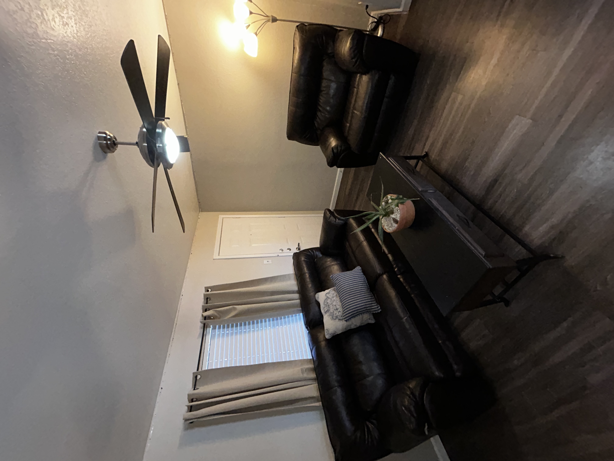

<!-- HERO -->
<header class="hero" style="text-align:center; padding:60px 20px; background:#f9f9f9;">
  
  <h1 style="font-size:2.5em; margin:10px 0;">Premium Furniture Without the Premium Price</h1>
  
High-quality sofas delivered fast. No showroom markups.

  <a href="tel:19792508196" class="cta-button" style="display:inline-block; padding:15px 30px; font-size:1.2em; background-color:#000; color:white; text-decoration:none; border-radius:8px; transition:background 0.3s;">📞 Call Now</a>
</header>

<!-- PRODUCTS -->
<section class="section">
  <h2>Featured Sofas</h2>
  

    

      
      <h3>Reclining Couch</h3>
      
Electric Functionality. Adjustable to your needs.

    

    

      
      <h3>Leather Sofa Set</h3>
      
Luxury Feel. Unbeatable Comfort.

    

  

</section>

<!-- ABOUT -->
<section class="section light" style="background-color:#f9f9f9; padding:60px 20px; text-align:center;">
  <h2>About Sofa King Sales</h2>
  

    Sofa King Furniture offers what no one else dares! FREE DELIVERY. 0% In-House Financing. $0 Down.
  

</section>

<!-- NEWSLETTER -->
<section class="section newsletter" style="padding:60px 20px; text-align:center; background:#000; color:white;">
  <h2 style="font-size:2em; margin-bottom:10px;">Get 5% Off Your First Purchase</h2>
  
Join our email list and receive a discount code instantly.

  <!-- Zoho Campaigns Web-Optin Form Starts Here -->
  

    

      

        
      

      

        

          

            <table width="100%" cellpadding="0" cellspacing="0" border="0">
              <tbody>
                <tr>
                  <td width="10%">
                    
                  </td>
                  <td>
                    &nbsp;&nbsp;Thank you for Signing Up
                  </td>
                </tr>
              </tbody>
            </table>
          

        

        <form method="POST" id="zcampaignOptinForm" action="https://zgnp-zngp.maillist-manage.com/weboptin.zc" target="_zcSignup" onsubmit="zcScptlessSubmit(this)">
          
Please correct the marked field(s) below.

          

            
Claim 5% Off of Your First Purchase!

            
Our Deals are Sofa King Amazing.

            

              <input type="text" placeholder="Email Address" changeitem="SIGNUP_FORM_FIELD" name="CONTACT_EMAIL" id="EMBED_FORM_EMAIL_LABEL">
            

            

              <input type="submit" name="SIGNUP_SUBMIT_BUTTON" id="zcWebOptin" value="SIGN UP" style="background-color:#000; color:white;">
            

          

          <input type="hidden" id="fieldBorder" value="">
          <input type="hidden" id="submitType" name="submitType" value="optinCustomView">
          <input type="hidden" id="emailReportId" name="emailReportId" value="">
          <input type="hidden" id="formType" name="formType" value="QuickForm">
          <input type="hidden" name="zx" id="cmpZuid" value="13679d3a8">
          <input type="hidden" name="zcvers" value="3.0">
          <input type="hidden" name="oldListIds" id="allCheckedListIds" value="">
          <input type="hidden" id="mode" name="mode" value="OptinCreateView">
          <input type="hidden" id="zcld" name="zcld" value="1164a208b5a63fd3f">
          <input type="hidden" id="zctd" name="zctd" value="1164a208b5a63fb91">
          <input type="hidden" id="document_domain" value="">
          <input type="hidden" id="zc_Url" value="zgnp-zngp.maillist-manage.com">
          <input type="hidden" id="new_optin_response_in" value="0">
          <input type="hidden" id="duplicate_optin_response_in" value="0">
          <input type="hidden" name="zc_trackCode" id="zc_trackCode" value="ZCFORMVIEW">
          <input type="hidden" id="zc_formIx" name="zc_formIx" value="3zb115fb68cdee52ca5719a29b55bf836898cbd5c5b43fd6f1391fe6f0253ef9f4">
          <input type="hidden" id="viewFrom" value="URL_ACTION">
          <input type="hidden" id="scriptless" name="scriptless" value="yes">
          <input type="hidden" id="zc_spmSubmit" name="zc_spmSubmit" value="ZCSPMSUBMIT">
        </form>
      

    

  

  

  

    
      
    
    

  

  

  <small>*Discount code sent via email.</small>
</section>

<!-- FOOTER -->
<footer>
  
© 2026 Sofa King Furniture. All rights reserved.

  

    Follow us: 
    <a href="https://www.instagram.com/sofa_king_furniture_1/" target="_blank">Instagram</a> | 
    <a href="https://www.facebook.com/profile.php?id=61586413496805" target="_blank">Facebook</a>
  

</footer>
